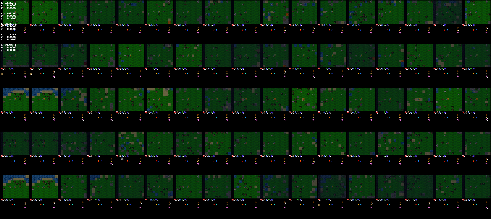
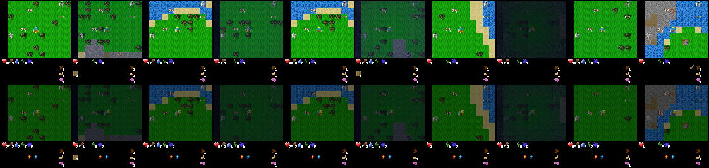

A fork to try
- [ ] pretrained LLM's vs plain
- [x] Use craftax environment

Imagine:


Reconstruction:



See also
- https://github.com/MichaelTMatthews/Craftax
- https://github.com/MichaelTMatthews/Craftax_Baselines
- https://github.com/RobertTLange/gymnax
- https://github.com/RobertTLange/gymnax-blines
- https://github.com/Farama-Foundation/Gymnasium

Original repository:
# Transformer-based World Models Are Happy With 100k Interactions (ICLR 2023)

Currently WIP.

Implementation of our Transformer-based World Model ([paper](https://openreview.net/pdf?id=TdBaDGCpjly)) in PyTorch.

Install packages from `requirements.txt`. Also make sure you have installed the Atari environments correctly.  
For more information, see: https://github.com/openai/gym/releases/tag/v0.21.0

Execute the following command to run an experiment:  
```
python -O scripts/main.py --game Breakout --seed 0 --device cuda:0 --cpu_p 1.0 --wandb disabled 
```

Use `--wandb online` to log the metrics in weights and biases.  
To use other hyperparameters, edit the file `twm/config.py`.

If you find the code in this repository useful, please cite our paper:
```
@inproceedings{
  robine2023transformerbased,
  title={Transformer-based World Models Are Happy With 100k Interactions},
  author={Jan Robine and Marc H{\"o}ftmann and Tobias Uelwer and Stefan Harmeling},
  booktitle={The Eleventh International Conference on Learning Representations },
  year={2023},
  url={https://openreview.net/forum?id=TdBaDGCpjly}
}
```
